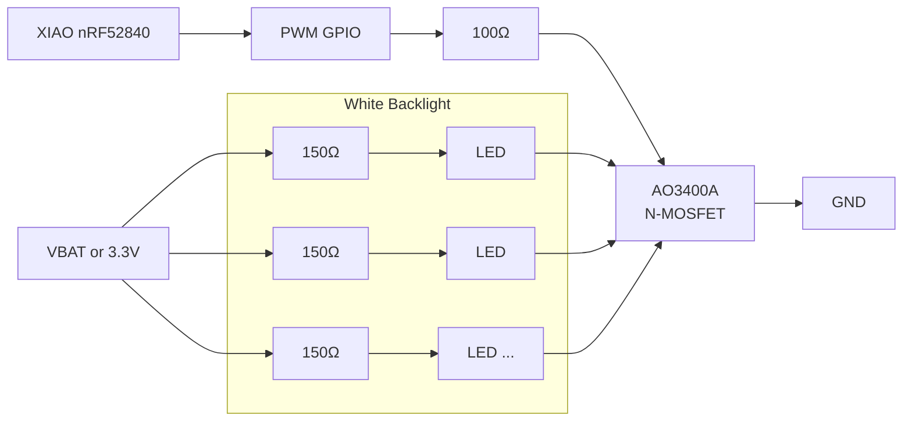

# Dormin Keyboard — White Backlight System

## Overview

Dormin uses a **single-zone white LED backlight** inspired by Apple's Magic Keyboard and MacBook keyboards. The goal is to provide a clean, elegant, and power-efficient backlight while keeping the hardware simple, inexpensive, and easy to manufacture with JLCPCB SMT Assembly.

Each keyboard half contains:

- One Seeed Studio XIAO nRF52840
- One PWM-controlled MOSFET
- One white LED underneath each key
- One current-limiting resistor per LED

The backlight is controlled as a single lighting zone, allowing global brightness adjustment without requiring a dedicated LED driver.

---

# Design Goals

- Apple-inspired appearance
- Uniform white illumination
- Low power consumption
- Minimal BOM
- Easy PCB routing
- JLCPCB SMT Assembly compatible
- ZMK firmware compatible
- Battery-friendly

---

# Why White Instead of RGB?

Dormin intentionally uses **white LEDs** instead of addressable RGB LEDs (SK6812 / WS2812).

## Advantages

- Lower power consumption
- Lower PCB complexity
- Lower firmware complexity
- Lower manufacturing cost
- Better battery life
- Uniform illumination
- Cleaner industrial design
- No unnecessary visual distractions

Since Dormin targets a professional and minimalist aesthetic, colorful lighting animations provide little practical value while increasing cost and reducing battery life.

---

# Why No LED Driver?

Dormin v1 intentionally avoids dedicated LED drivers (IS31FL37xx family).

Instead, all LEDs are switched simultaneously using a single MOSFET controlled by one PWM GPIO.

## Advantages

- One GPIO required
- Very small BOM
- Easy schematic
- Easy PCB routing
- Excellent battery life
- Less firmware complexity

The trade-off is that all LEDs share the same brightness.

---

# Supported Features

- ✅ Backlight ON / OFF
- ✅ Global brightness control
- ✅ PWM dimming
- ✅ Smooth fade in/out
- ✅ Auto-off after inactivity
- ✅ Battery-saving modes

## Not Supported

- ❌ Per-key lighting
- ❌ Wave animations
- ❌ Ripple effects
- ❌ Reactive typing
- ❌ Lighting zones

These features would require a dedicated LED driver.

---

# Bill of Materials (BOM)

| Component | Example Part Number | JLCPCB Assembly | Remarks | PCB / Schematic Notes |
|-----------|---------------------|-----------------|---------|-----------------------|
| MCU | Seeed Studio XIAO nRF52840 | No (module) | Main controller | One per keyboard half |
| White LED | 0603 Warm White LED (4000–4500K) | Yes | Backlight LED | One per key |
| LED Resistor | 150Ω 1% 0603 | Yes | Current limiting | One resistor per LED |
| MOSFET | AO3400A (SOT-23) | Yes | Low-side switch | One per keyboard half |
| Gate Resistor | 100Ω 0603 | Yes | Protects GPIO, reduces switching noise | Between MCU GPIO and MOSFET Gate |
| Gate Pull-down | 100kΩ 0603 | Yes | Keeps MOSFET OFF during boot | Gate to GND |
| Decoupling Capacitor | 10µF X5R/X7R 0603 or 0805 | Yes | Stabilizes LED power rail | Place near MOSFET |

---

# Electrical Architecture

- One PWM GPIO controls one MOSFET.
- The MOSFET switches the ground connection for all LEDs.
- Each LED has its own resistor to guarantee consistent brightness.
- Brightness is controlled using PWM generated by the XIAO nRF52840.

---

# Simplified Schematic



---

# Recommended PCB Placement

```
               Switch

          White LED (0603)
                 │
            150Ω Resistor

──────────────────────────────────

        (Repeat for every key)

                 │
      All LED cathodes combined
                 │

             AO3400A
          (near the MCU)

          100Ω     100kΩ
GPIO ─────/\/\/────┐
                   │
                 Gate
                   │
                  GND
```

---

# Future Upgrade Path

If a future Dormin revision requires advanced lighting effects (wave, ripple, per-key brightness, reactive typing), the current architecture can be upgraded by replacing the MOSFET-controlled backlight with an I²C LED driver (e.g., IS31FL3731 or IS31FL3741).

The mechanical design and LED placement can remain unchanged, minimizing the redesign effort.

---

# Summary

The chosen architecture provides the best balance between aesthetics, simplicity, manufacturability, and battery life.

- Apple-inspired white backlight
- One PWM GPIO per keyboard half
- One AO3400A MOSFET per half
- One resistor per LED
- No dedicated LED driver
- Fully compatible with ZMK
- Low component count
- Easy JLCPCB SMT assembly
- Ready for future expansion if advanced lighting effects become desirable