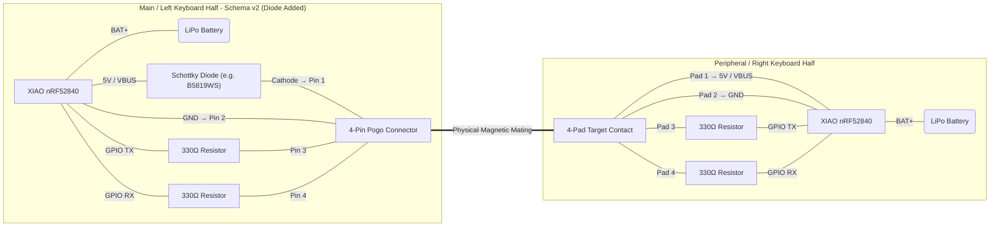

```mermaid
flowchart LR

%% =====================================================================
%% LEFT HALF
%% =====================================================================

subgraph LEFT["Main / Left Half"]

    USB["USB_VBUS"]
    PF["Polyfuse (Optional)"]
    D["Schottky Diode"]
    TVS5L["5V TVS"]

    MCU_L["XIAO nRF52840 Plus"]
    BAT_L["LiPo Battery"]

    TVSD_L["2-Channel TVS"]
    R1["33Ω"]
    R2["33Ω"]

    POGO_L["4-Pin Pogo Connector"]

    BAT_L <-->|BAT+/BAT-| MCU_L

    USB --> PF
    PF --> D
    D --> POGO_L

    POGO_L --- TVS5L
    TVS5L --> GNDL["GND"]

    MCU_L --> R1
    R1 --> TVSD_L
    TVSD_L --> POGO_L

    MCU_L --> R2
    R2 --> TVSD_L

    MCU_L --- GNDL
    GNDL --> POGO_L

end

%% =====================================================================
%% RIGHT HALF
%% =====================================================================

subgraph RIGHT["Peripheral / Right Half"]

    POGO_R["4-Pin Target Pads"]

    TVS5R["5V TVS"]
    TVSD_R["2-Channel TVS"]

    R3["33Ω"]
    R4["33Ω"]

    MCU_R["XIAO nRF52840 Plus"]
    BAT_R["LiPo Battery"]

    GNDR["GND"]

    BAT_R <-->|BAT+/BAT-| MCU_R

    POGO_R --> MCU_R

    POGO_R --- TVS5R
    TVS5R --> GNDR

    POGO_R --> TVSD_R
    TVSD_R --> R3
    R3 --> MCU_R

    TVSD_R --> R4
    R4 --> MCU_R

    POGO_R --> GNDR
    MCU_R --- GNDR

end

%% =====================================================================
%% MECHANICAL CONNECTION
%% =====================================================================

POGO_L ===|"Magnetic Pogo Interface"| POGO_R
````
